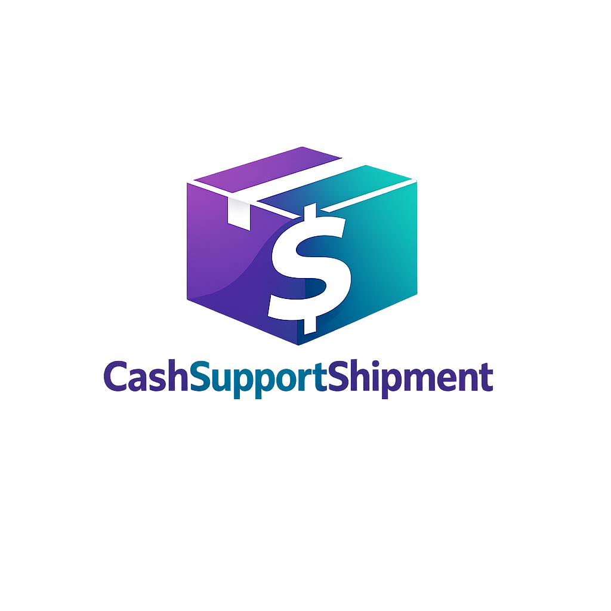

# CashSupportShipment - Logistics & Shipment Tracking Platform



A modern, full-stack logistics platform for seamless shipment tracking, logistics management, and P2P point systems. Built with React, TypeScript, Node.js, and SQLite.

## 🚀 Features

### Frontend
- **Modern Landing Page** - Professional design with animated sections
- **Real-time Tracking** - Track shipments with live updates
- **User Authentication** - Secure login and registration
- **Responsive Design** - Works on all devices
- **Interactive UI** - Smooth animations and transitions

### Admin Dashboard
- **User Management** - Create, edit, delete users
- **Shipment Management** - Full CRUD operations
- **Content Editor** - Edit website content without coding
- **Analytics** - Track platform performance
- **Settings** - Configure platform settings

### Backend API
- **RESTful API** - Clean, documented endpoints
- **JWT Authentication** - Secure token-based auth
- **SQLite Database** - Lightweight, serverless database
- **Input Validation** - Request validation and sanitization
- **Error Handling** - Comprehensive error responses

## 📁 Project Structure

```
cashsupportshipment/
├── app/                          # Frontend React Application
│   ├── public/                   # Static assets
│   │   ├── logo.png              # Brand logo
│   │   ├── hero-dashboard.jpg    # Hero section image
│   │   ├── step1-account.jpg     # How it works images
│   │   ├── step2-fleet.jpg
│   │   ├── step3-track.jpg
│   │   └── avatar-*.jpg          # Testimonial avatars
│   ├── src/
│   │   ├── components/           # Reusable components
│   │   │   └── admin/            # Admin dashboard components
│   │   ├── sections/             # Landing page sections
│   │   ├── pages/                # Page components
│   │   ├── hooks/                # Custom React hooks
│   │   ├── types/                # TypeScript types
│   │   └── lib/                  # Utility functions
│   ├── package.json
│   └── vite.config.ts
├── backend/                      # Backend Node.js API
│   ├── server.js                 # Main server file
│   ├── package.json
│   └── .env.example              # Environment variables template
├── Design.md                     # Design specifications
├── DEPLOYMENT_GUIDE.md           # Complete deployment guide
└── README.md                     # This file
```

## 🛠️ Tech Stack

### Frontend
- **React 18** - UI library
- **TypeScript** - Type safety
- **Vite** - Build tool
- **Tailwind CSS** - Styling
- **shadcn/ui** - UI components
- **React Router** - Navigation
- **Lucide React** - Icons

### Backend
- **Node.js** - Runtime
- **Express** - Web framework
- **SQLite** - Database
- **JWT** - Authentication
- **bcryptjs** - Password hashing
- **express-validator** - Input validation

## 🚀 Quick Start

### Prerequisites
- Node.js v18+ 
- npm v9+

### Installation

1. **Install Frontend Dependencies**
```bash
cd app
npm install
```

2. **Install Backend Dependencies**
```bash
cd backend
npm install
```

3. **Configure Environment**
```bash
cd backend
cp .env.example .env
# Edit .env with your settings
```

4. **Start Development Servers**

Terminal 1 - Backend:
```bash
cd backend
npm run dev
```

Terminal 2 - Frontend:
```bash
cd app
npm run dev
```

5. **Access the Application**
- Frontend: http://localhost:5173
- Backend API: http://localhost:5000

## 🔑 Default Credentials

### Admin Account
- **Email**: `admin@cashsupportshipment.com`
- **Password**: `admin123`

⚠️ **Change the default password immediately after first login!**

## 📖 Documentation

- [Deployment Guide](DEPLOYMENT_GUIDE.md) - Complete deployment instructions
- [Design Specs](Design.md) - Design system and specifications
- [API Documentation](DEPLOYMENT_GUIDE.md#api-documentation) - API endpoints reference

## 🎨 Customization

### Brand Colors
Edit `tailwind.config.js`:
```javascript
colors: {
  purple: { 600: '#7f56d9' },
  teal: { 500: '#14b8a6' },
  navy: { 950: '#1e1b4b' },
}
```

### Content Editing
Access the admin dashboard at `/admin` and use the Content Editor to modify:
- Hero section text
- Feature descriptions
- Testimonials
- FAQ items
- Contact information

### Logo Replacement
Replace `app/public/logo.png` with your own logo (recommended: 512x512px, transparent background).

## 🚢 Deployment

See [DEPLOYMENT_GUIDE.md](DEPLOYMENT_GUIDE.md) for detailed instructions on:
- VPS/Cloud Server deployment
- Heroku deployment
- Railway/Render deployment
- SSL configuration
- Database management

### Quick Deploy to Production

```bash
# Build frontend
cd app
npm run build

# Start backend
cd ../backend
npm start
```

## 🔒 Security

- JWT-based authentication
- Password hashing with bcrypt
- Input validation and sanitization
- CORS protection
- Security headers

## 📝 API Endpoints

### Authentication
- `POST /api/auth/register` - Register new user
- `POST /api/auth/login` - Login user
- `GET /api/auth/me` - Get current user

### Shipments
- `POST /api/shipments` - Create shipment
- `GET /api/shipments` - List shipments
- `GET /api/shipments/track/:trackingNumber` - Track shipment (public)
- `PUT /api/shipments/:id/status` - Update status

### Users
- `GET /api/users` - List users (admin)
- `GET /api/users/:id` - Get user
- `PUT /api/users/:id` - Update user
- `DELETE /api/users/:id` - Delete user (admin)

## 🧪 Testing

### Demo Tracking Numbers
Use these tracking numbers for testing:
- `CSS123456789` - In Transit
- `CSS987654321` - Delivered
- `CSS456789123` - Pending

### Creating Test Shipments
1. Login as admin
2. Go to Admin Dashboard → Shipments
3. Click "Create Shipment"
4. Fill in the details
5. Save

## 🐛 Troubleshooting

### Common Issues

**Port already in use:**
```bash
sudo lsof -i :5000
sudo kill -9 <PID>
```

**Database locked:**
```bash
rm backend/database.sqlite
# Restart server to recreate
```

**Build errors:**
```bash
cd app
rm -rf node_modules package-lock.json
npm install
npm run build
```

## 📞 Support

For support and questions:
- Email: support@cashsupportshipment.com
- Documentation: See DEPLOYMENT_GUIDE.md

## 📄 License

This project is licensed under the MIT License.

---

**Built with ❤️ by CashSupportShipment Team**
